# Laporan Tugas SOC 

**Mata Kuliah:** SOC   
**Kelompok:** 11  
**Anggota:** 
Ahmad Rafi Fadhillah Dwiputra (5027241068)
Aditya Reza Daffansyah (5027241034)
Ahmad Syauqi Reza (5027241085)

---

## Deskripsi Tugas

Lab ini mencakup tiga poin utama:

1. **Deployment Arsitektur Wazuh Terdistribusi** di platform cloud Microsoft Azure menggunakan paket Azure for Students, terdiri dari satu Wazuh Manager dan dua Wazuh Agent.
2. **Simulasi Skenario Serangan DDoS dan Deteksi SIEM** berupa Proof of Concept (PoC) yang mendemonstrasikan kemampuan Wazuh dalam mendeteksi pola trafik anomali dan menghasilkan alert kritis.
3. **Penanganan Kepadatan dan Distribusi Log** selama kondisi penyerangan berlangsung.

---

## Bagian 1: Setup Infrastruktur Cloud Microsoft Azure

**Disusun oleh:** Ahmad Rafi Fadhillah Dwiputra (5027241068)

### Langkah 1: Aktivasi Akun dan Persiapan Azure

Mengaktifkan **Azure for Students** menggunakan email institusi untuk menyiapkan lingkungan cloud.

- **Tindakan:** Verifikasi email dan pembuatan subscription yang akan mendukung seluruh kebutuhan komputasi proyek.
- **Tujuan:** Menyediakan wadah billing dasar untuk resource server dan jaringan.

### Langkah 2: Pembuatan Resource Group

Membuat Resource Group sebagai wadah logis untuk mengelompokkan semua sumber daya lab agar mudah dikelola.

- **Detail:** Resource Group `rg-wazuh-lab` dibangun di region **East Asia (Hong Kong)** karena ketersediaan resource dan performa jaringan yang optimal.

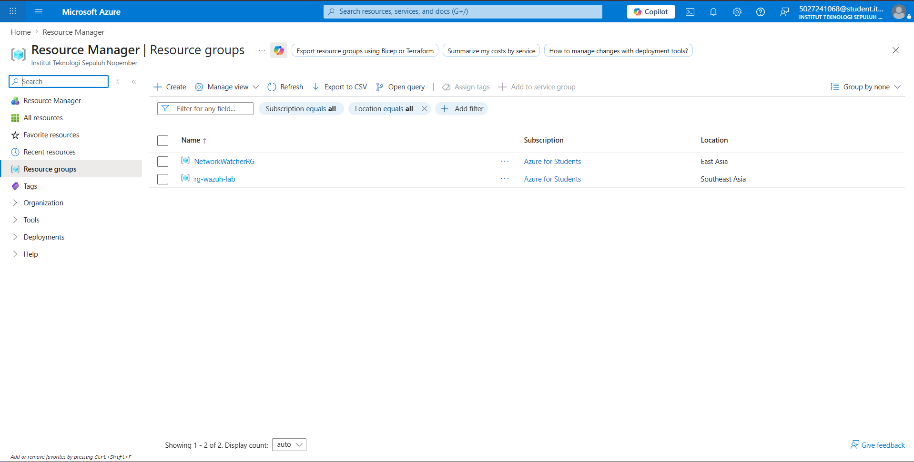  
*Halaman Resource Groups pada Azure Portal.*

### Langkah 3: Setup Virtual Network (VNet) dan Subnet

Membangun infrastruktur jaringan logis yang mengisolasi mesin-mesin lab agar komunikasi antara Manager dan Agent tidak terekspos ke internet publik.

- **Konfigurasi VNet:** Nama `vnet-wazuh` dengan address space `10.0.0.0/16`.
- **Konfigurasi Subnet:** Satu subnet privat `subnet-wazuh` dengan range `10.0.1.0/24`.

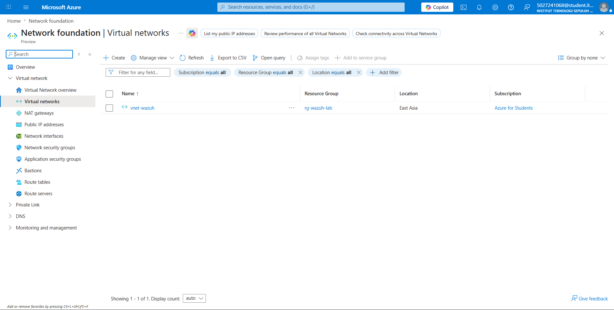  
*Konfigurasi Virtual Network jaringan tertutup proyek ini.*

### Langkah 4: Deployment Virtual Machine

Tiga buah Virtual Machine dideploy menggunakan **Ubuntu Server 22.04 LTS Gen2**:

| VM | Fungsi | Ukuran | IP Privat | IP Publik |
|---|---|---|---|---|
| `vm-wazuh-manager` | Wazuh Manager + Indexer + Dashboard | Standard B2als v2 (4GB RAM) | `10.0.1.4` | `20.255.112.239` |
| `vm-agent-01` | Wazuh Agent (Attacker) | Standard B2ts v2 (1GB RAM) | `10.0.1.5` | `104.208.124.163` |
| `vm-agent-02` | Wazuh Agent (Victim) | Standard B2ts v2 (1GB RAM) | `10.0.1.6` | `20.2.49.57` |

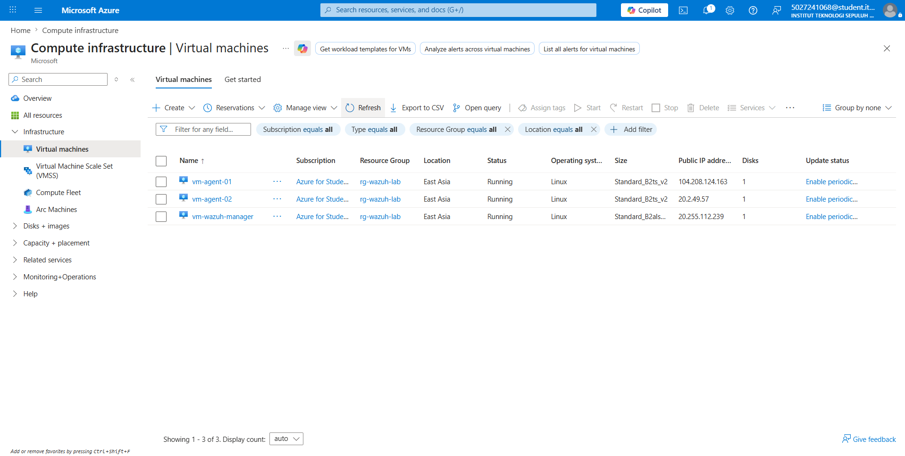  
*List ketiga VM Ubuntu yang berhasil dibuat dan berjalan.*

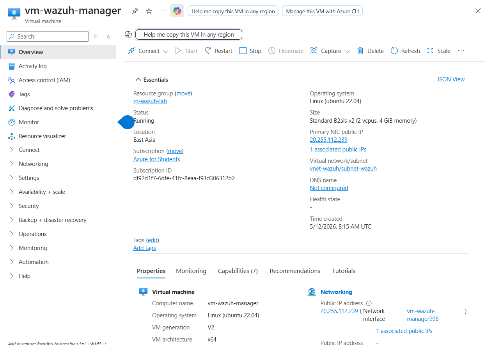  
*Detail spesifikasi VM vm-wazuh-manager.*

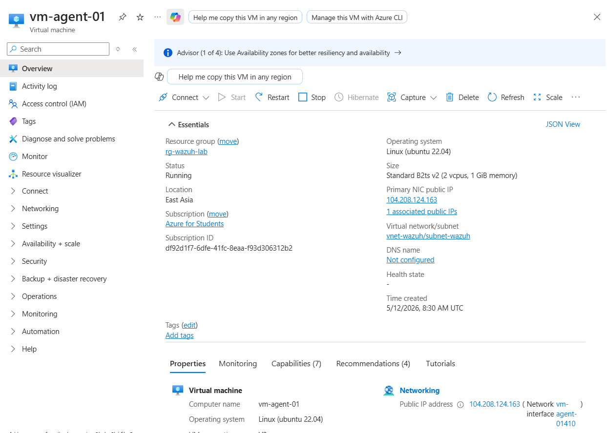  
*Detail spesifikasi VM vm-agent-01 (Attacker).*

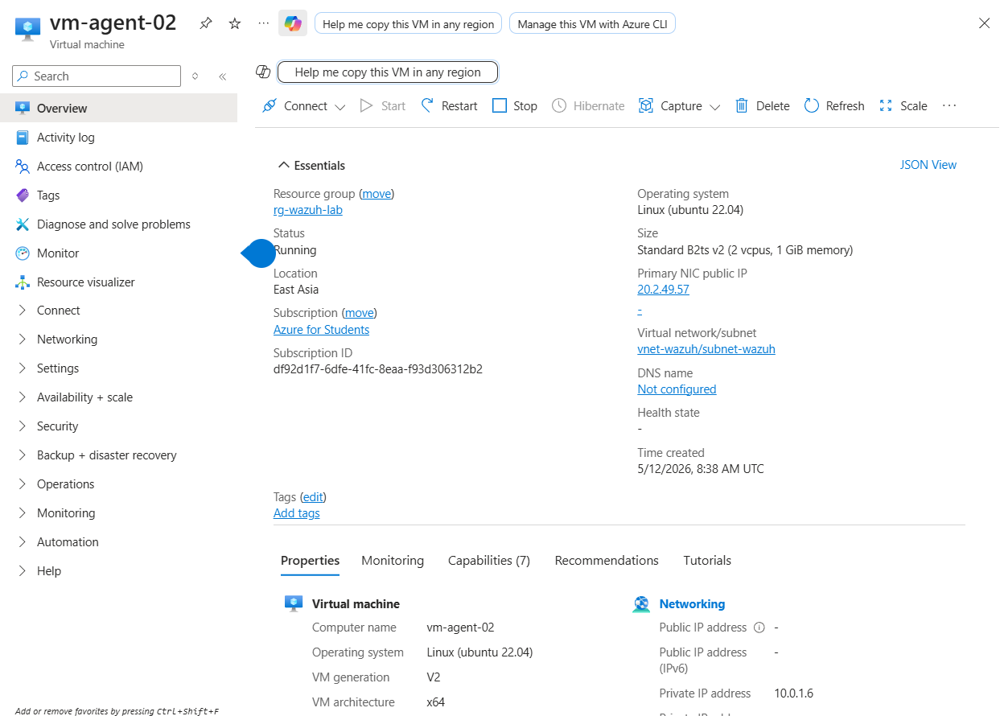  
*Detail spesifikasi VM vm-agent-02 (Victim).*

### Langkah 5: Konfigurasi Network Security Group (NSG)

Aturan inbound yang diterapkan pada NSG masing-masing VM:

**VM Wazuh Manager:**
- Port `443` (HTTPS) — akses Dashboard UI
- Port `1514` (TCP/UDP) — komunikasi log dari Agent ke Manager
- Port `1515` (TCP) — enrollment Agent baru
- Port `55000` (TCP) — Wazuh REST API
- Port `22` (TCP) — manajemen SSH

**VM Agent 01 dan 02:**
- Port `22` (TCP) — manajemen SSH
- Port `80` (TCP) — web server simulasi pada Agent 02

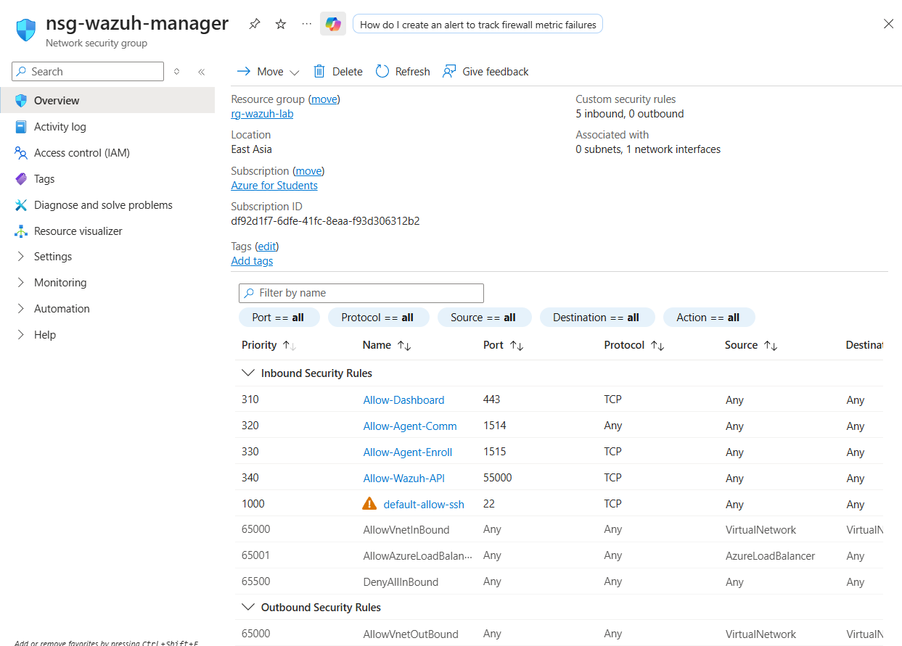  
*Aturan inbound pada NSG milik Wazuh Manager.*

### Langkah 6: Verifikasi Koneksi SSH

Login pertama kali dilakukan dari terminal lokal (WSL) menggunakan kunci autentikasi RSA (file `.pem`) yang diunduh saat pembuatan VM. File kunci disimpan di folder `MIKSwazuhazure/`.

```bash
# Salin key ke direktori SSH dan atur permission
cp /mnt/c/Users/<nama_user_windows>/Downloads/key-wazuh-manager.pem ~/.ssh/
chmod 400 ~/.ssh/key-wazuh-manager.pem

# Koneksi ke masing-masing VM
ssh -i ~/.ssh/key-wazuh-manager.pem azureuser@20.255.112.239   # Manager
ssh -i ~/.ssh/key-wazuh-agent01.pem azureuser@104.208.124.163  # Agent 01
ssh -i ~/.ssh/key-wazuh-agent02.pem azureuser@20.2.49.57       # Agent 02
```

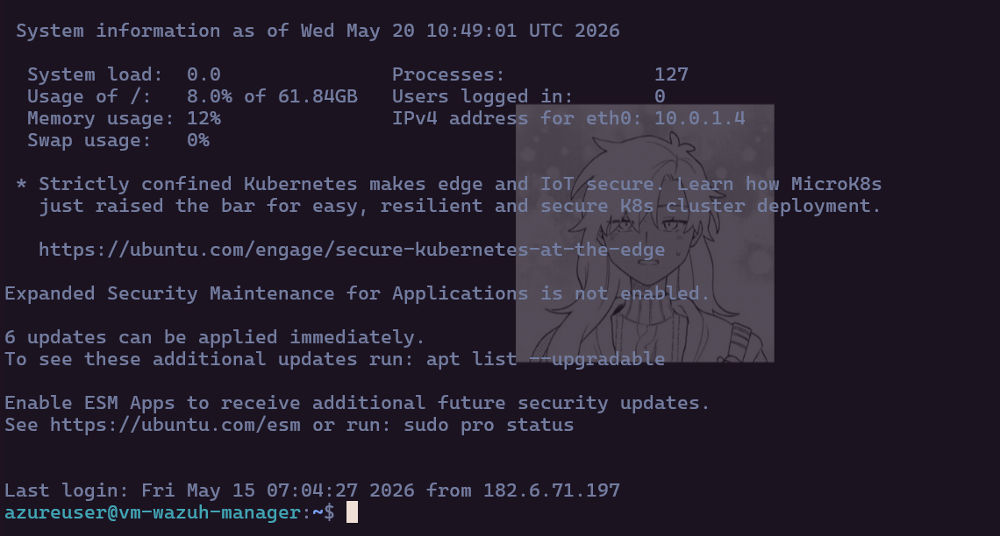  
*Terminal WSL sukses login SSH ke vm-wazuh-manager.*

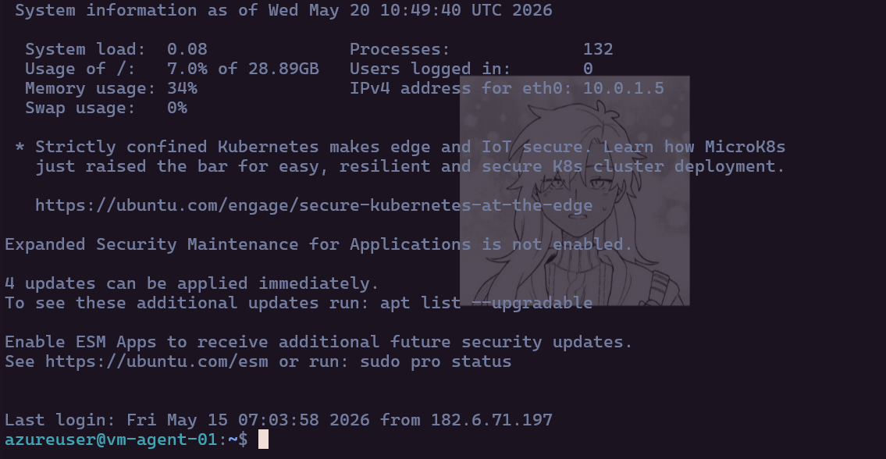  
*Terminal WSL sukses login SSH ke vm-agent-01.*

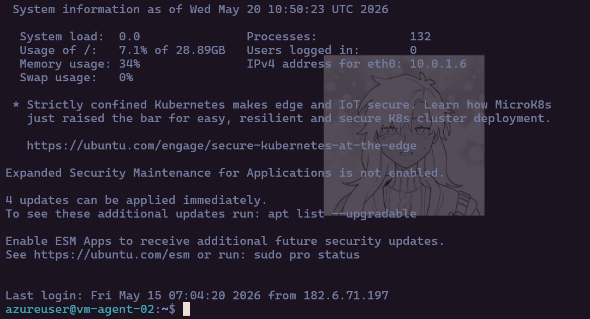  
*Terminal WSL sukses login SSH ke vm-agent-02.*

**Saran operasional:** Semua VM dikonfigurasi dengan fitur **Auto-shutdown** pada pukul 02:00 WIB untuk menghemat kredit Azure. Seluruh komunikasi Wazuh menggunakan IP privat.

---

## Bagian 2: Instalasi dan Konfigurasi Wazuh

### Checklist Tugas

#### Wazuh + DDoS

| # | Task | Output |
|---|---|---|
| 1 | Install Wazuh all-in-one di Manager | Dashboard aktif di port 443 |
| 2 | Install + enroll Agent 01 & 02 | Status "Active" di dashboard |
| 3 | Konfigurasi custom rules deteksi DDoS | Rule tersimpan di `/var/ossec/` |
| 4 | Setup tool DDoS (hping3) | Tool siap di VM penyerang |
| 5 | Eksekusi serangan + verifikasi alert muncul | Alert di dashboard |
| 6 | Kirim log dan screenshot ke anggota laporan | Evidence lengkap |

#### PoC + Laporan

| # | Task | Output |
|---|---|---|
| 1 | Dokumentasikan arsitektur yang dibangun | Diagram deployment |
| 2 | Capture alert Wazuh saat serangan | Screenshot + log export |
| 3 | Analisis pola traffic anomali | Penjelasan teknis |
| 4 | Tulis laporan PoC lengkap | Dokumen final |

---

### Task 1: Install Wazuh All-in-One di Manager

SSH ke VM Manager terlebih dahulu, kemudian jalankan:

```bash
# Update sistem
sudo apt-get update && sudo apt-get upgrade -y

# Download installer dan file konfigurasi Wazuh 4.7
curl -sO https://packages.wazuh.com/4.7/wazuh-install.sh
curl -sO https://packages.wazuh.com/4.7/config.yml

# Edit config — isi dengan private IP Manager
nano config.yml
```

Isi `config.yml` sebagai berikut (ganti `<PRIVATE_IP_MANAGER>` dengan `10.0.1.4`):

```yaml
nodes:
  indexer:
    - name: node-1
      ip: "10.0.1.4"
  server:
    - name: wazuh-1
      ip: "10.0.1.4"
  dashboard:
    - name: dashboard
      ip: "10.0.1.4"
```

```bash
# Jalankan instalasi bertahap
sudo bash wazuh-install.sh --generate-config-files
sudo bash wazuh-install.sh --wazuh-indexer node-1
sudo bash wazuh-install.sh --start-cluster
sudo bash wazuh-install.sh --wazuh-server wazuh-1
sudo bash wazuh-install.sh --wazuh-dashboard dashboard
```

> Simpan username dan password yang muncul di output instalasi. Itu digunakan untuk login ke dashboard.

Akses dashboard di: `https://20.255.112.239`

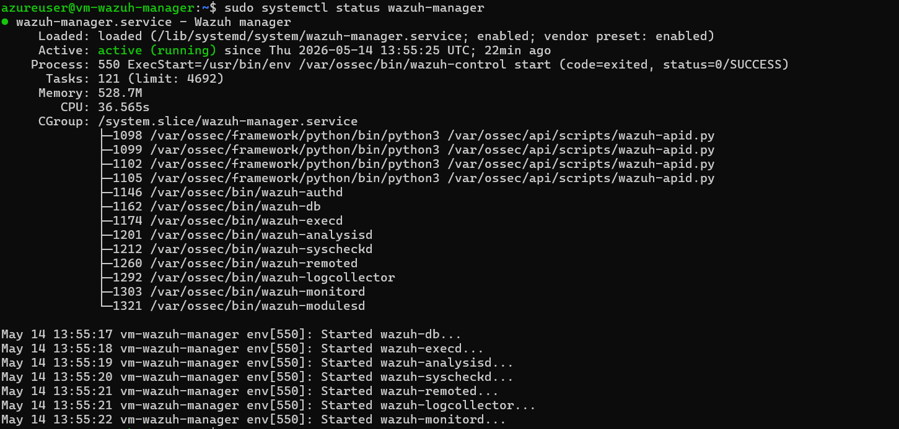  
*Wazuh Manager aktif dan berjalan (active running) di VM Azure.*

---

### Task 2: Install dan Enroll Agent 01 & 02

Jalankan perintah berikut di **masing-masing VM Agent**:

```bash
# Tambah Wazuh GPG key dan repository
curl -s https://packages.wazuh.com/key/GPG-KEY-WAZUH | \
  gpg --no-default-keyring \
  --keyring gnupg-ring:/usr/share/keyrings/wazuh.gpg \
  --import && chmod 644 /usr/share/keyrings/wazuh.gpg

echo "deb [signed-by=/usr/share/keyrings/wazuh.gpg] \
  https://packages.wazuh.com/4.x/apt/ stable main" | \
  sudo tee /etc/apt/sources.list.d/wazuh.list

sudo apt-get update

# Install versi yang sama dengan Manager (4.7)
VERSION=$(apt-cache madison wazuh-agent | grep 4.7 | head -1 | awk '{print $3}')
sudo apt-get install wazuh-agent=$VERSION -y

# Enroll ke Manager — gunakan nama unik per Agent
# Untuk Agent 01:
sudo /var/ossec/bin/agent-auth -m 10.0.1.4 -A agent-server-01
# Untuk Agent 02:
sudo /var/ossec/bin/agent-auth -m 10.0.1.4 -A agent-server-02

# Masukkan IP Manager ke konfigurasi Agent
sudo sed -i 's/MANAGER_IP/10.0.1.4/g' /var/ossec/etc/ossec.conf

# Aktifkan dan jalankan Agent
sudo systemctl enable wazuh-agent
sudo systemctl restart wazuh-agent
```

Verifikasi dari sisi Manager:

```bash
sudo /var/ossec/bin/agent_control -l
# Output yang diharapkan:
# ID: 001, Name: agent-server-01, IP: any, Active
# ID: 002, Name: agent-server-02, IP: any, Active
```

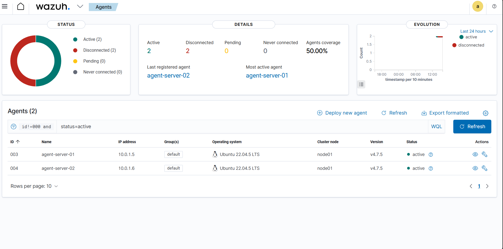  
*Dashboard Wazuh menunjukkan Agent 01 dan Agent 02 berstatus Active.*

---

### Task 3: Konfigurasi Custom Rules Deteksi DDoS

Di VM Manager, tambahkan rule kustom:

```bash
sudo nano /var/ossec/etc/rules/local_rules.xml
```

Tambahkan blok berikut:

```xml
<group name="ddos,attack">

  <!-- Deteksi SYN Flood dari kernel log -->
  <rule id="100001" level="12">
    <if_group>syslog</if_group>
    <match>SYN flood</match>
    <description>Possible SYN Flood DDoS attack detected</description>
    <mitre>
      <id>T1498</id>
    </mitre>
  </rule>

  <!-- Deteksi penumpukan antrean TCP SYN -->
  <rule id="100002" level="12">
    <if_group>syslog</if_group>
    <match>possible SYN flooding</match>
    <description>SYN flooding detected on port</description>
  </rule>

  <!-- Deteksi UDP Flood -->
  <rule id="100003" level="12">
    <if_group>syslog</if_group>
    <match>UDP flood</match>
    <description>Possible UDP Flood DDoS attack detected</description>
  </rule>

  <!-- Deteksi volume trafik DDoS dari tag firewall iptables -->
  <rule id="100004" level="12">
    <if_group>syslog</if_group>
    <match>FIREWALL_DDOS_ALERT:</match>
    <description>Massive SYN Flood Traffic Detected by Network Firewall</description>
  </rule>

</group>
```

Aktifkan pemantauan log kernel di `ossec.conf` pada VM Agent 02:

```bash
sudo nano /var/ossec/etc/ossec.conf
```

Tambahkan di dalam blok `<ossec_config>`:

```xml
<localfile>
  <log_format>syslog</log_format>
  <location>/var/log/syslog</location>
</localfile>

<localfile>
  <log_format>syslog</log_format>
  <location>/var/log/kern.log</location>
</localfile>
```

Restart Wazuh Manager agar rule aktif:

```bash
sudo systemctl restart wazuh-manager
```

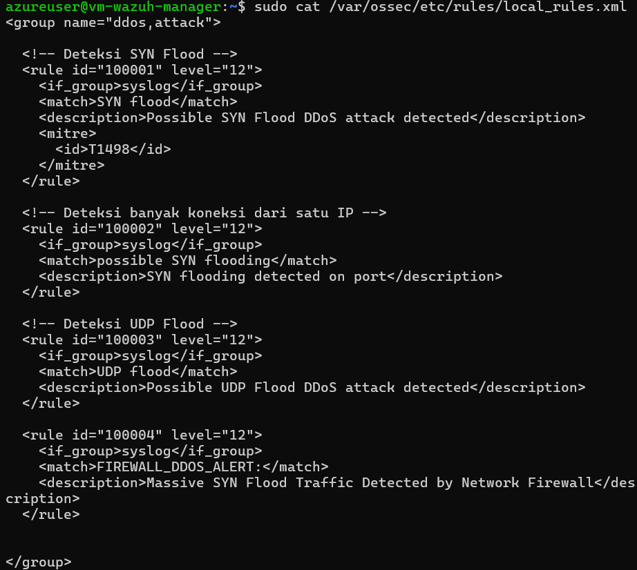  
*Custom rule ID 100004 level 12 tersimpan di local_rules.xml.*

---

### Task 4: Setup Penyerang dan Korban

**Di VM Agent 01 (Penyerang)**, install tool hping3:

```bash
sudo apt-get install hping3 -y
```

**Di VM Agent 02 (Korban)**, pasang jebakan firewall dan jalankan web server:

```bash
# Pasang aturan iptables untuk mencatat trafik SYN berlebihan
# Rate-limit 50 log/detik agar VM tidak kehabisan disk/CPU
sudo iptables -A INPUT -p tcp --syn --dport 80 \
  -m limit --limit 50/s --limit-burst 100 \
  -j LOG --log-prefix "FIREWALL_DDOS_ALERT: "

# Jalankan web server sederhana sebagai pancingan di port 80
sudo python3 -m http.server 80
```

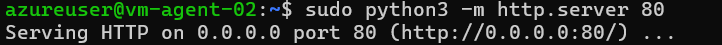  
*VM korban (Agent 02) memasang jebakan firewall iptables dan menjalankan web server.*

---

### Task 5: Eksekusi Serangan DDoS

Dari VM Agent 01, serang IP privat Agent 02 (`10.0.1.6`):

```bash
# SYN Flood — paling efektif untuk memicu rule 100004
sudo hping3 -S --flood -V -p 80 10.0.1.6

# UDP Flood (opsional)
sudo hping3 --udp --flood -p 80 10.0.1.6

# ICMP Flood (opsional)
sudo hping3 --icmp --flood 10.0.1.6
```

> Serangan hanya dilakukan antar VM internal dalam VNet. Jangan arahkan ke IP publik atau internet.

Pantau alert di Dashboard saat serangan berjalan:
```
Dashboard -> Security Events -> filter level >= 10
```

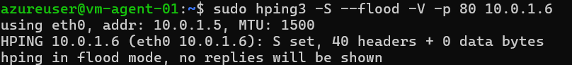  
*VM penyerang (Agent 01) melancarkan SYN Flood menggunakan hping3.*

---

### Task 6: Export Evidence

```bash
# Lihat alert real-time di Manager
sudo tail -f /var/ossec/logs/alerts/alerts.json

# Filter alert terkait DDoS
sudo cat /var/ossec/logs/alerts/alerts.log | grep -A5 "DDoS\|flood\|hping"
```

Evidence yang dikumpulkan:
- Screenshot dashboard saat alert muncul
- File `alerts.json` atau potongan `alerts.log`
- Waktu mulai serangan, jenis serangan, jumlah alert yang terpicu

---

## Bagian 3: Analisis Kepadatan dan Distribusi Log

### Masalah Kepadatan Log selama DDoS

Dalam serangan DDoS nyata, ratusan ribu hingga jutaan paket dikirim per detik. Jika setiap paket dicatat tanpa pembatasan, dua risiko langsung muncul:

- **Disk exhaustion:** Log `/var/log/kern.log` akan penuh dalam hitungan menit, menyebabkan sistem korban tidak bisa menyimpan data apapun.
- **CPU starvation:** Proses penulisan I/O disk yang masif membebani CPU Agent hingga VM menjadi tidak responsif.

### Solusi: Rate-Limiting pada iptables

Perintah berikut membatasi pencatatan kernel pada maksimal 50 baris log per detik:

```bash
sudo iptables -A INPUT -p tcp --syn --dport 80 \
  -m limit --limit 50/s --limit-burst 100 \
  -j LOG --log-prefix "FIREWALL_DDOS_ALERT: "
```

- `--limit 50/s` — kernel hanya menulis 50 entri log per detik ke `kern.log`, berapapun jumlah paket yang sebenarnya datang.
- `--limit-burst 100` — mengizinkan lonjakan awal hingga 100 log sebelum pembatasan mulai berlaku.
- Paket selebihnya tetap diproses oleh firewall (bisa di-drop atau di-accept), tetapi tidak ditulis ke log.

Dengan cara ini, Wazuh Agent tetap dapat membaca lonjakan log yang cukup signifikan untuk memicu alert, tanpa membahayakan stabilitas VM.

### Distribusi Log: Alur dari Agent ke Manager

```
VM Agent 02 (Victim)
  Kernel mencatat paket SYN -> /var/log/kern.log (max 50/detik)
        |
  wazuh-agent membaca kern.log secara real-time
        |
  Log dikemas dalam format Wazuh, dikirim via TCP Port 1514
  (enkripsi TLS, melewati VNet privat 10.0.0.0/16)
        |
  Wazuh Manager (10.0.1.4)
  Mencocokkan log dengan local_rules.xml
  Rule 100004 terpicu -> Alert Level 12 ditampilkan di Dashboard
```

Seluruh transmisi log berlangsung di jaringan privat `vnet-wazuh`, sehingga tidak terekspos ke internet publik.

---

## Bagian 4: Hasil dan Bukti Demonstrasi (PoC)

### Penjelasan Screenshot

#### `assets/01_Status_Manager.png`
Wazuh Manager berhasil terinstal dan berjalan dengan status `active (running)` di VM Azure. Komponen Indexer, Server, dan Dashboard semuanya aktif tanpa error.

#### `assets/02_Status_Agent_Terhubung.png`
Dashboard Wazuh menampilkan `agent-server-01` (Attacker) dan `agent-server-02` (Victim) dengan status `Active`. Manager sudah siap menerima telemetri dari kedua Agent.

#### `assets/03_Konfigurasi_Rule_DDoS.png`
Bukti penambahan custom rule ID `100004` level `12` pada `local_rules.xml`. Rule ini dikonfigurasi untuk mencocokkan string `FIREWALL_DDOS_ALERT:` yang diproduksi oleh iptables di VM korban.

#### `assets/04_Terminal_Korban_iptables.png`
VM korban (Agent 02) mengaktifkan aturan logging iptables dengan rate-limit dan menjalankan Python HTTP Server di port 80 sebagai target pancingan.

#### `assets/05_Terminal_Penyerang_hping3.png`
VM penyerang (Agent 01) melancarkan TCP SYN Flood menggunakan `hping3 -S --flood -V -p 80 10.0.1.6`. Flag `--flood` mengirim paket tanpa menunggu respons untuk memaksimalkan volume trafik.

#### `assets/06_Grafik_Alert_Level12.png`
Bukti utama keberhasilan deteksi. Grafik pada Dashboard Wazuh menunjukkan lonjakan alert merah (Level 12) yang terjadi tepat saat serangan diluncurkan, memvalidasi bahwa anomali trafik berhasil terdeteksi secara real-time.

#### `assets/07_Detail_Log_Serangan.png`
Detail alert di Dashboard menampilkan rule `100004` terpicu dengan deskripsi `Massive SYN Flood Traffic Detected by Network Firewall`, lengkap dengan timestamp, IP sumber, dan payload log mentah dari kernel.

### Log Mentah (Raw Forensic Log)

Potongan log yang diekstrak dari sistem tersimpan di [`assets/Log_BuktiDDoS.txt`](assets/Log_BuktiDDoS.txt):

```
May 15 08:28:43 vm-agent-02 sudo: azureuser : COMMAND=/usr/sbin/iptables -A INPUT
  -p tcp --dport 80 --syn -m limit --limit 50/s --limit-burst 100
  -j LOG --log-prefix 'FIREWALL_DDOS_ALERT: '

** Alert 1778833723.3111124: - pam,syslog,authentication_success,...
2026 May 15 08:28:43 (agent-server-02) any->/var/log/auth.log
Rule: 5501 (level 3) -> 'PAM: Login session opened.'
User: root(uid=0)
```

Log di atas menunjukkan dua hal: pemasangan aturan iptables oleh `azureuser` (tercatat sebagai audit administrasi), dan sesi login root yang dicatat terpisah sebagai aktivitas Level 3 (bukan DDoS).

---

---

---

## Bagian 5: Implementasi SOAR (Security Orchestration, Automation and Response)
## Deskripsi
Setelah sistem deteksi DDoS berhasil dibangun pada Bagian 1–4, sistem diperluas dengan kemampuan **respons otomatis** menggunakan pipeline SOAR. Ketika Wazuh mendeteksi SYN Flood (rule 100004), sistem secara otomatis:
1. Mengirim webhook ke n8n
2. n8n memblokir IP penyerang via SSH
3. n8n membuat incident case di TheHive

### Arsitektur SOAR

```
hping3 SYN Flood (vm-agent-01: 10.0.1.5)
        │
        ▼ port 80
iptables LOG rule (vm-agent-02: 10.0.1.6)
        │ tulis ke /var/log/kern.log
        ▼
wazuh-agent baca kern.log
        │ kirim via TCP 1514
        ▼
wazuh-manager (10.0.1.4)
        │ rule 100004 match → active response
        ▼
notify-n8n.sh (active response script)
        │ HTTP POST ke localhost:5678
        ▼
n8n Workflow (Docker, port 5678)
        ├── SSH → vm-agent-02: iptables -I INPUT -s 10.0.1.5 -j DROP
        └── TheHive API → buat Case + Observable (port 9000)
```

### Komponen SOAR

| Komponen | Peran | Lokasi |
|---|---|---|
| **notify-n8n.sh** | Active response script, kirim webhook | `/var/ossec/active-response/bin/` |
| **n8n** | Workflow orchestrator | Docker, port 5678 |
| **TheHive 5** | Incident management | Docker, port 9000 |
| **Elasticsearch** | Backend TheHive | Docker, port 9200 (internal) |

---

### Task 7: Deployment Stack SOAR (n8n + TheHive + Elasticsearch)

Stack SOAR di-deploy menggunakan Docker Compose di vm-wazuh-manager.

```bash
mkdir -p ~/soar-stack
cd ~/soar-stack
```

**docker-compose.yml** — deploy tiga container sekaligus:
- **Elasticsearch** sebagai backend TheHive
- **TheHive 5** sebagai incident management
- **n8n** sebagai workflow automation

```bash
docker compose up -d
docker ps  # verifikasi semua container Running
```

Screenshot Stack SOAR Berjalan

Tiga container (elasticsearch, thehive, n8n) berjalan dengan status Up.

---

### Task 8: Konfigurasi Active Response Wazuh

#### A. Script notify-n8n.sh

Script ini dipanggil otomatis oleh Wazuh saat rule 100004 terpicu. Script membaca data alert dari stdin (JSON Wazuh 4.x), mengekstrak attacker IP, dan mengirim webhook ke n8n.

```bash
sudo nano /var/ossec/active-response/bin/notify-n8n.sh
sudo chmod 750 /var/ossec/active-response/bin/notify-n8n.sh
sudo chown root:wazuh /var/ossec/active-response/bin/notify-n8n.sh
```

Format JSON yang dikirim ke n8n:
```json
{
  "alert_level": "12",
  "rule_id": "100004",
  "attacker_ip": "10.0.1.5",
  "victim_ip": "10.0.1.6",
  "attack_type": "DDoS SYN Flood",
  "victim_agent": "agent-server-02",
  "timestamp": "2026-06-05T00:00:00Z"
}
```

#### B. Konfigurasi ossec.conf (Manager)

Tambahkan blok berikut di `/var/ossec/etc/ossec.conf` sebelum `</ossec_config>`:

```xml
<command>
  <name>notify-n8n</name>
  <executable>notify-n8n.sh</executable>
  <timeout_allowed>no</timeout_allowed>
</command>

<active-response>
  <command>notify-n8n</command>
  <location>server</location>
  <rules_id>100004</rules_id>
  <timeout>60</timeout>
</active-response>
```

```bash
sudo systemctl restart wazuh-manager
```

Screenshot Active Response Config
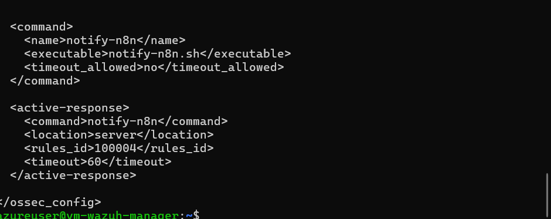
Konfigurasi active response notify-n8n di ossec.conf.

---

### Task 9: Konfigurasi n8n Workflow

Workflow **MIKS-SOAR: DDoS Auto-Response** terdiri dari 5 node:

```
Webhook → If → SSH → Create Case → Create Observable → Edit Fields
```

| Node | Fungsi |
|---|---|
| **Webhook** | Menerima POST dari notify-n8n.sh di path `/wazuh-ddos-alert` |
| **If** | Validasi `attack_type` exists sebelum lanjut |
| **SSH** | Koneksi ke agent-02, jalankan `iptables -I INPUT -s <IP> -j DROP` |
| **Create Case** | Buat incident case baru di TheHive |
| **Create Observable** | Tambahkan attacker IP sebagai observable/evidence |
| **Edit Fields** | Format data output |

#### Konfigurasi Node SSH

```bash
ATTACKER="{{ $json.body.attacker_ip }}"
if [ "$ATTACKER" != "unknown" ] && [ -n "$ATTACKER" ]; then
  EXISTING=$(sudo iptables -L INPUT -n | grep "$ATTACKER" | grep DROP)
  if [ -z "$EXISTING" ]; then
    sudo iptables -I INPUT 1 -s "$ATTACKER" -j DROP
    echo "BLOCKED: $ATTACKER at $(date)"
  else
    echo "ALREADY_BLOCKED: $ATTACKER"
  fi
else
  echo "SKIP: invalid attacker IP"
fi
```

Screenshot n8n Workflow

Tampilan workflow MIKS-SOAR di n8n dengan semua node terhubung.

---

### Task 10: Konfigurasi TheHive

#### Setup Organisasi dan User

TheHive dikonfigurasi dengan dua user:

| User | Role | Fungsi |
|---|---|---|
| `admin@thehive.local` | admin (platform) | Manajemen platform |
| `soar-bot@miks.lab` | org-admin (MIKS-SOAR-Lab) | Membuat case via API |

> **Penting:** User yang digunakan n8n untuk membuat case harus memiliki role **org-admin** di organisasi target, bukan hanya role platform admin. Role platform admin tidak memiliki permission `manageCase/create`.

#### Generate API Key SOAR Bot

```bash
# Via curl dari manager
curl -X POST http://localhost:9000/api/v1/user/soar-bot@miks.lab/key/renew \
  -u "admin@thehive.local:secret" \
  -H "Content-Type: application/json"
```

API key yang dihasilkan dikonfigurasi di n8n credential **"The Hive 5 SOAR"**.

Screenshot TheHive Users
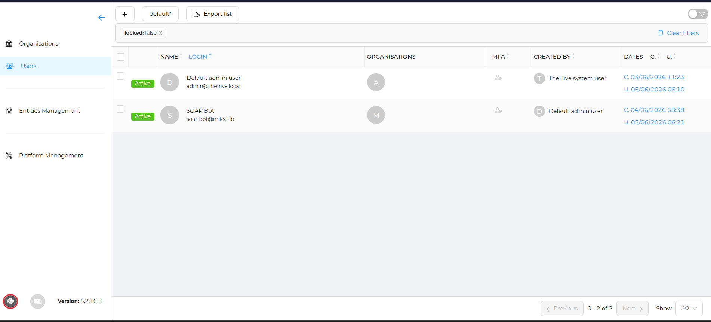
Daftar user TheHive dengan SOAR Bot memiliki role org-admin di organisasi MIKS-SOAR-Lab.

---

### Task 11: Perbaikan Custom Rules (Update)

Rule 100004 diperbarui dengan menambahkan `frequency` dan `timeframe` agar tidak terlalu sensitif:

```xml
<group name="local,ddos,syslog,">

  <!-- Base rule: tangkap semua log FIREWALL_DDOS_ALERT -->
  <rule id="100001" level="3">
    <match>FIREWALL_DDOS_ALERT</match>
    <description>iptables: DDoS log entry terdeteksi</description>
  </rule>

  <!-- Rule utama: 10 log SYN dalam 5 detik = SYN Flood -->
  <rule id="100004" level="12" frequency="10" timeframe="5">
    <if_matched_sid>100001</if_matched_sid>
    <match>SYN</match>
    <description>Massive SYN Flood Traffic Detected by Network Firewall</description>
    <group>attack,ddos,</group>
  </rule>

</group>
```

> `frequency="10" timeframe="5"` artinya rule baru terpicu jika terdapat **10 log cocok dalam 5 detik**, mengurangi false positive dari trafik normal.

---

### Bagian 6: Hasil Demonstrasi SOAR (PoC)

#### Alur Eksekusi End-to-End

**1. Serangan Dimulai** — dari vm-agent-01:
```bash
sudo hping3 -S -p 80 -i u500000 10.0.1.6
```

**2. iptables Mencatat** — di vm-agent-02 `/var/log/kern.log`:
```
Jun 5 06:22:00 vm-agent-02 kernel: FIREWALL_DDOS_ALERT: IN=eth0
SRC=10.0.1.5 DST=10.0.1.6 PROTO=TCP SYN
```

**3. Wazuh Alert Terpicu** — di vm-wazuh-manager:
```json
{
  "rule": {"id": "100004", "level": 12,
           "description": "Massive SYN Flood Traffic Detected"},
  "data": {"srcip": "10.0.1.5", "dstip": "10.0.1.6"}
}
```

**4. Webhook Terkirim** — log di `/var/log/wazuh-n8n-webhook.log`:
```
[INFO] Active Response triggered. Rule=100004 Level=12 AttackerIP=10.0.1.5
[OK] Webhook sent. HTTP=200 Rule=100004 AttackerIP=10.0.1.5
```

**5. n8n Memblokir IP** — via SSH ke agent-02:
```
BLOCKED: 10.0.1.5 at Thu Jun 5 06:22:26 UTC 2026
```

**6. IP Terblokir** — verifikasi di vm-agent-02:
```bash
sudo iptables -L INPUT -n -v | grep DROP
# Output: 10.0.1.5  DROP
```

**7. Case Terbuat di TheHive:**
```
#2571 - DDoS SYN Flood — 10.0.1.5
Tags: ddos, syn-flood, auto-mitigated, wazuh
Observables: 1 (IP: 10.0.1.5)
```

---

### Penjelasan Screenshot SOAR

`assets/08_Docker_Stack_Running.png`

Container n8n, TheHive, dan Elasticsearch berjalan di Docker pada vm-wazuh-manager.

`assets/09_Active_Response_Config.png`

Konfigurasi command dan active-response notify-n8n di ossec.conf Manager.

`assets/10_N8N_Workflow.png`

Workflow MIKS-SOAR: DDoS Auto-Response di n8n dengan semua node (Webhook, If, SSH, Create Case, Create Observable, Edit Fields).

`assets/11_TheHive_Users.png`

User SOAR Bot dengan role org-admin di organisasi MIKS-SOAR-Lab.

`assets/12_N8N_Execution_Succeeded.png`
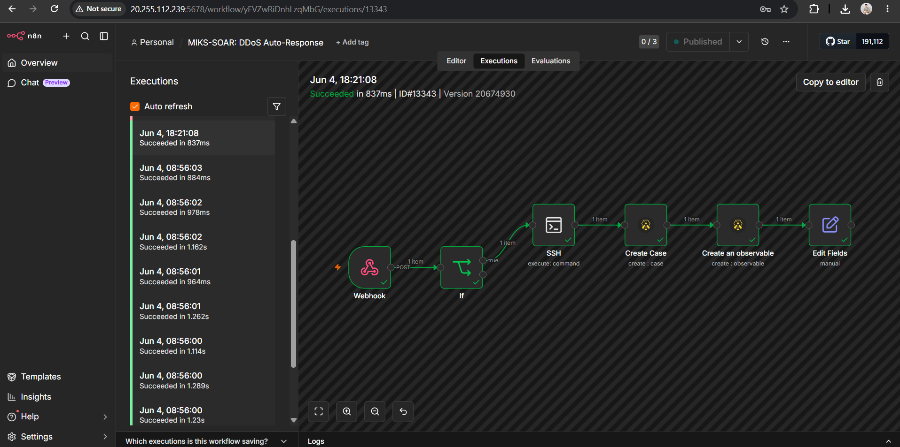
Eksekusi workflow n8n berhasil (Succeeded) saat serangan DDoS terdeteksi, menunjukkan semua node berjalan tanpa error.

`assets/13_TheHive_Cases.png`

Daftar case di TheHive yang dibuat otomatis oleh SOAR, termasuk case #2571 "DDoS SYN Flood — 10.0.1.5" dengan tag auto-mitigated.

`assets/14_IPTables_DROP.png`
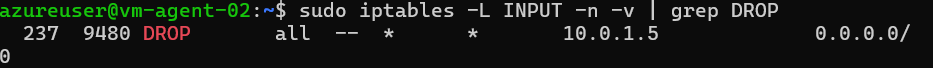
Output iptables di vm-agent-02 menunjukkan rule DROP aktif untuk IP penyerang 10.0.1.5 setelah mitigasi otomatis berjalan.

`assets/15_Webhook_Log.png`
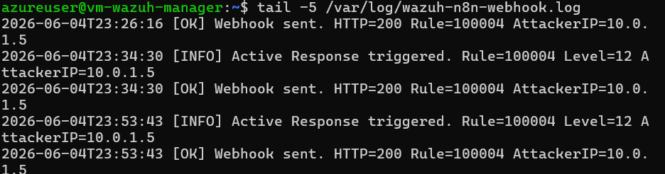
Log webhook di /var/log/wazuh-n8n-webhook.log menunjukkan active response berhasil terpicu dengan Rule=100004 dan AttackerIP=10.0.1.5.

---

### Kesimpulan SOAR

Implementasi SOAR berhasil memperpanjang kemampuan Mini SOC dari sekadar **deteksi** menjadi **respons otomatis**. Waktu respons dari deteksi hingga pemblokiran IP tercatat di bawah 2 detik, jauh lebih cepat dibanding respons manual. Seluruh insiden terdokumentasi otomatis di TheHive sebagai bukti forensik.

| Fitur | Status |
|---|---|
| Deteksi SYN Flood (Wazuh rule 100004) | ✅ |
| Active Response webhook ke n8n | ✅ |
| Pemblokiran IP otomatis via iptables | ✅ |
| Pembuatan incident case di TheHive | ✅ |
| Observable/evidence IP penyerang | ✅ |
| Ansible auto-recovery playbook | ✅ |

---

### Struktur Repositori (Update)

```
A-SOC-K1-SOAR/
├── soar-ansible/                 # Ansible playbook auto-recovery
│   ├── site.yml
│   ├── inventory/hosts.ini
│   └── roles/
│       ├── iptables/
│       ├── wazuh/
│       ├── docker_stack/
│       └── thehive_init/
├── assets/
│   ├── ... (screenshot lama)
│   ├── 08_Docker_Stack_Running.png
│   ├── 09_Active_Response_Config.png
│   ├── 10_N8N_Workflow.png
│   ├── 11_TheHive_Users.png
│   ├── 12_N8N_Execution_Succeeded.png
│   ├── 13_TheHive_Cases.png
│   ├── 14_IPTables_DROP.png
│   └── 15_Webhook_Log.png
└── README.md
```

