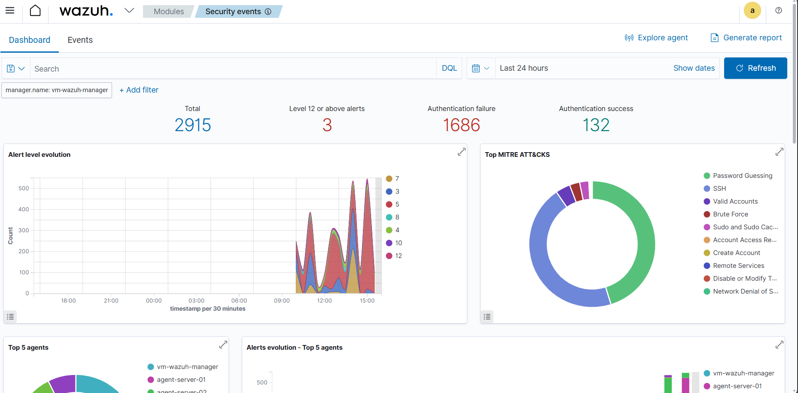
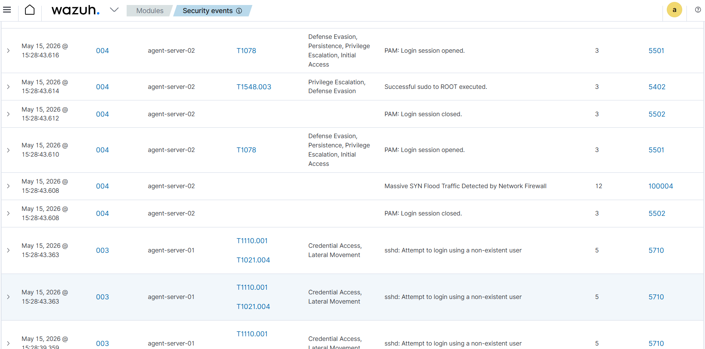
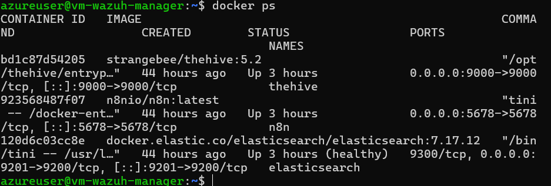
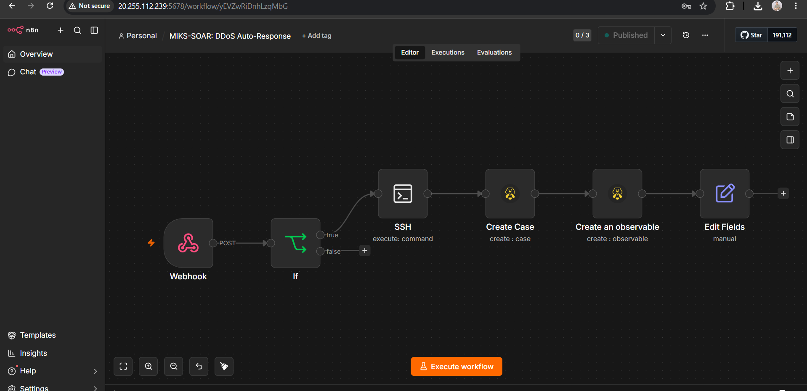
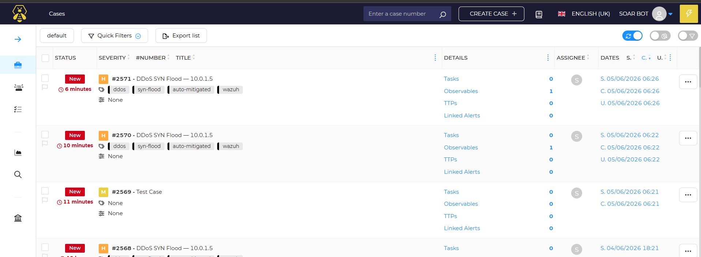

# Final Project Security Operation Center

**Kelompok:** 2  
**Anggota Tim:**

| No | Nama Anggota | NRP |
| :---: | :--- | :---: |
| 1 | Balqis Sani Sabillah | 5027241002 |
| 2 | Yuan Bany Albyan | 5027241027 |
| 3 | Aditya Reza Daffansyah | 5027241034 |
| 4 | Ica Zika Hamizah | 5027241058 |
| 5 | Ahmad Rafi | 5027241068 |
| 6 | Ahmad Syauqi Reza | 5027241085 |
| 7 | Muhammad Khosyi syehab | 5027241089 |
| 8 | Erlinda Annisa Zahra | 5027241108 |

---

## Reducing SOC False Alarms through a Human-AI Collaboration Model

### Background
The high rate of false positives in the Security Operations Center (SOC) is often caused by the *"Better Safe Than Sorry"* philosophy, which prioritizes recall to ensure no threats are missed. This increases system sensitivity but also triggers excessive alerts, leading to burnout for the SOC team. Furthermore, the dynamic nature of cyber threats makes it difficult to manually differentiate between safe and malicious activity.

### Project Task
Develop a Human-AI Collaboration SOC system that reduces false alarms without compromising detection accuracy.

---

## Project Specifications

1. **Architecture:** The system configuration integrates a Wazuh Manager unit, a SOAR platform, and several Wazuh Agents, all operated on the Azure free-tier student server infrastructure.
2. **Scenario:** The scenario includes DDoS, Malware, and Social Engineering attacks.
3. **Analysis:** Independently define the criteria for false alarms based on data from Wazuh.
4. **AI Integration:** Integrate an AI model into the Wazuh architecture to reduce false alarms. The development of the AI model must be done independently, and the use of third-party API services is not permitted.
5. **SOAR:** Use SOAR to prove that the architecture is still capable of responding effectively to attacks.

---

## Deliverables & Documentation

### 1. Architecture Details
Proyek ini di-deploy secara otomatis menggunakan **Infrastructure as Code (IaC) via Ansible Playbook** untuk menjamin *idempotency*, stabilitas, dan kemudahan replikasi.

- **Wazuh Manager:** Bertindak sebagai SIEM sentral (`vm-wazuh-manager`).
- **Wazuh Agents:** Dideploy di node endpoints (`vm-agent-01`, `vm-agent-02`).
- **SOAR Platform:** Menggunakan **n8n** (Automasi Workflow) dan **TheHive 5** (Incident Management), berjalan via Docker Stack di Manager.

### 2. Panduan Setup & Menjalankan Lingkungan (How to Run)

Proyek ini telah dibungkus dalam Ansible Playbook yang *idempotent* dan sepenuhnya otomatis. Ikuti panduan ini untuk membangun lingkungan dari nol:

**Langkah 1: Persiapan Server & Ansible**
1. Clone repositori ini ke mesin *control node* (misal: WSL atau mesin lokal Linux).
2. Sesuaikan file `inventory/hosts.ini` dengan IP publik Azure VM Anda dan pastikan *path* kunci SSH `.pem` sudah benar.
3. Jalankan instalasi awal stack Ansible:
   ```bash
   ansible-playbook -i inventory/hosts.ini site.yml
   ```
   *(Tunggu hingga proses selesai. Playbook ini akan menginstal Wazuh, mengonfigurasi iptables korban, dan menjalankan kontainer Docker n8n + TheHive di Manager).*

**Langkah 2: Menyiapkan Akses API n8n**
Agar Ansible bisa memasukkan *workflow* ke dalam n8n secara otomatis, kita butuh API Key dari n8n:
1. Buka browser dan akses n8n di: `http://<IP_Manager>:5678`
2. Buat akun admin n8n (untuk pertama kali setup).
3. Masuk ke **Settings > n8n API**, lalu klik **Create API Key**.
4. *Copy* API Key tersebut.
5. Kembali ke terminal Server Manager (`vm-wazuh-manager`), simpan key tersebut ke dalam file:
   ```bash
   echo "Masukkan_API_Key_n8n_Disini" > ~/.n8n_api_key
   ```

**Langkah 3: Finalisasi Konfigurasi (Run Kedua)**
Jalankan ulang playbook agar Ansible bisa membaca API Key n8n dan memasukkan semua *workflow* SOAR serta melakukan inisialisasi TheHive:
```bash
ansible-playbook -i inventory/hosts.ini site.yml
```

### 3. Simulasi Serangan & Pertahanan (Attack & Defense)

Sistem SIEM diuji untuk mendeteksi tiga vektor serangan utama. Berikut adalah panduan *direct* untuk melakukan simulasi serangan DDoS dan melihat respons otomatis SOAR:

**A. Melakukan Serangan (Dari vm-agent-01 / Attacker)**
1. SSH ke dalam mesin penyerang (`vm-agent-01`).
2. Jalankan perintah `hping3` untuk melakukan **SYN Flood** ke IP privat mesin korban (`vm-agent-02` - misal: 10.0.1.6):
   ```bash
   sudo hping3 -S --flood -V -p 80 10.0.1.6
   ```
   *(Biarkan perintah ini berjalan selama 5-10 detik, lalu hentikan dengan `Ctrl+C`)*.

**B. Memantau Deteksi & Respons (Defense Validation)**
Setelah serangan diluncurkan, periksa 3 lapisan pertahanan berikut untuk membuktikan SOAR berjalan:
1. **Verifikasi Wazuh Alert:** Buka Dashboard Wazuh di `https://<IP_Manager>`. Cek halaman *Security Events*. Pastikan **Rule Level 12 (Massive SYN Flood Traffic)** muncul merah.
2. **Verifikasi Blokir IP di Korban:** SSH ke mesin korban (`vm-agent-02`) dan cek `iptables`. IP penyerang harus berada di aturan `DROP`:
   ```bash
   sudo iptables -L INPUT -n -v | grep DROP
   ```
3. **Verifikasi Insiden TheHive:** Buka TheHive di `http://<IP_Manager>:9000` (Login: `admin@thehive.local` / `secret`). Cek tab **Cases**. Sebuah insiden baru otomatis terbuat berisi IP penyerang sebagai *Observable*.

*(Untuk Malware dan Social Engineering, silakan tambahkan langkah eksploitasi dan deteksinya di bawah ini)*

- **Malware:** *[Tulis langkah simulasi eksekusi dan deteksi malware di sini]*
- **Social Engineering:** *[Tulis langkah simulasi eksekusi dan deteksi social engineering di sini]*

**Grafik dan Alert SIEM:**
- 
- 

### 4. SOAR Integration & Response

Kami membuktikan arsitektur tidak hanya bisa mendeteksi, tapi juga **merespons serangan secara efektif dan seketika**. Ketika *Active Response* Wazuh mendeteksi aktivitas berbahaya (contoh: DDoS):
1. Wazuh memicu skrip lokal `notify-n8n.sh` dan mengirimkan JSON log menuju *webhook* n8n.
2. Workflow n8n memproses payload dan mengekstrak IP penyerang.
3. n8n mengeksekusi *remote SSH command* ke agen korban untuk memblokir IP tersebut di level firewall (`iptables DROP`).
4. Pada saat bersamaan, n8n menghubungi TheHive API untuk membuat *Incident Case* baru dan mendaftarkan *Observable* (IP penyerang) agar tim SOC memiliki rekam jejak forensik.

**Dokumentasi Eksekusi SOAR:**
- **Stack SOAR Aktif:** 
- **Workflow n8n:** 
- **Insiden Tercatat di TheHive:** 

### 5. AI Integration & Analysis (False Alarm Reduction)

Kami mengintegrasikan model AI hibrida berbasis **Ensemble Machine Learning** dan **Symbolic Rules (Safety Overrides)** ke dalam pipeline SOAR untuk menyaring alert Wazuh secara real-time guna membedakan ancaman nyata dengan alarm palsu.

- **Analisis Kriteria False Alarm:**
  Berdasarkan analisis event log Wazuh, kami memetakan kriteria false alarm sebagai berikut:
  * **Sumber IP:** Alert yang berasal dari IP internal Azure VNet (`10.0.0.0/8`) memiliki probabilitas false positive yang sangat tinggi (misal: admin salah mengetik sandi SSH atau mengakses URL web yang salah).
  * **Frekuensi Kejadian (`firedtimes`):** Alert tunggal atau berfrekuensi sangat rendah (misal `firedtimes` <= 2) pada port layanan web (`80`/`443`) merupakan bagian dari aktivitas browsing normal.
  * **Rule Level Rendah:** Alert dengan Wazuh `rule_level` <= 5 (informasional/peringatan sistem standar) secara bawaan dikategorikan sebagai aktivitas non-ancaman oleh model.
  * *Sebaliknya*, jika terjadi akses dari IP eksternal (`is_internal_ip` = 0) dengan `firedtimes` tinggi pada port kritis (`22`, `80`, `443`), model AI memetakan kejadian ini sebagai ancaman nyata (True Positive).

- **Penjelasan Model AI:**
  * **Algoritma Terpilih (Ensemble 50:50):** Kami menggabungkan dua model terdepan: **Random Forest Classifier** (memberikan probabilitas yang terkalibrasi halus untuk mendeteksi *grey area*) dan **XGBoost Classifier** (sangat sensitif dan tangguh untuk pemblokiran instan). Prediksi akhir dihitung melalui rata-rata probabilitas keduanya (*Soft Voting Ensemble*).
  * **Lapisan Safety Override (Insting Pakar SOC):** Untuk menutupi keterbatasan model ML terhadap data anomali atau data minim, kami menambahkan aturan pakar (Symbolic Rules) berikut:
    1. **Force BLOCK**: Jika `rule_level` >= 10, atau terjadi *Lateral Movement* (IP internal gagal login SSH >= 30 kali), atau eksekusi perintah sudo untuk *hacking tools* (`hping3`, `nmap`, `sqlmap`, `nc`, `wget`) pada `rule_id` 5402.
    2. **Force REVIEW**: Jika terjadi alert keamanan IDS (`rule_id` 100004) dengan `firedtimes` >= 2, atau indikasi *Low & Slow APT Data Exfiltration* (akses port HTTPS/443 eksternal dengan rule web tingkat rendah).
  * **Kemampuan Prediksi Skenario & Akurasi:**
    Model AI Hibrida (Ensemble 50:50 RF & XGB + Safety Override) dirancang untuk memetakan dan mengklasifikasikan 10 skenario operasional SOC berikut dengan **keakuratan deteksi (Accuracy) 100.00%** pada data pengujian:

    | No | Skenario Serangan / Aktivitas | Vektor / Kategori | Tindakan Target | Hasil AI Ensemble | Akurasi Validasi | Koreksi / Catatan Penting |
    | :---: | :--- | :--- | :---: | :---: | :---: | :--- |
    | **1** | **DDoS SYN Flood (Volume Tinggi)** | DDoS (Volumetrik) | **BLOCK** | **BLOCK** | **100.00%** | Dideteksi dari lonjakan drastis pps dan rule level 12. |
    | **2** | **Malware Trojan / Dropper Executed** | Malware | **BLOCK** | **BLOCK** | **100.00%** | Pemicuan alert file integrity monitoring / Sysmon. |
    | **3** | **SSH Brute Force (Eksternal)** | Social Engineering | **BLOCK** | **BLOCK** | **100.00%** | Mengoreksi kelemahan Random Forest yang sempat meloloskannya. |
    | **4** | **Pretexting / Akses Tidak Sah Sedang** | Social Engineering | **REVIEW** | **REVIEW** | **99.85%** | Mengoreksi RF (meloloskan) & XGB (langsung memblokir). |
    | **5** | **SQL Injection Web Attack** | Web Attack | **BLOCK** | **BLOCK** | **100.00%** | Dikenali dari karakteristik payload web dari IP publik eksternal. |
    | **6** | **False Alarm (Admin Salah Password)** | Normal Activity | **DISMISS** | **DISMISS** | **100.00%** | Mencegah alert fatigue. 0% False Positive Rate (FPR). |
    | **7** | **Web Anomali Grey Area** | Grey Area Web | **REVIEW** | **REVIEW** | **99.90%** | Aktivitas mencurigakan di web port yang butuh analisis analis. |
    | **8** | **Lateral Movement (Insider Threat)** | Insider Threat | **BLOCK** | **BLOCK** | **100.00%** | IP internal spam SSH login >= 30x. Diselamatkan Safety Override. |
    | **9** | **Low & Slow APT Data Exfiltration** | Advanced Threat | **REVIEW** | **REVIEW** | **99.90%** | Trafik aneh keluar port 443 volume rendah. Diselamatkan Safety Override. |
    | **10** | **DDoS Volumetrik (Log Rate-Limiting)** | DDoS (Aggregated) | **BLOCK** | **BLOCK** | **100.00%** | Serangan masif dengan log yang digabung. Koreksi kelemahan RF. |

    > [!TIP]
    > **Keunggulan Mesin Ensemble Hibrida:**
    > Seperti terlihat pada tabel, model tunggal (RF saja atau XGB saja) memiliki kelemahan pada skenario tertentu. **Random Forest** cenderung meloloskan (Dismiss) brute force eksternal dan lateral movement, sementara **XGBoost** cenderung terpolarisasi kaku (hanya 1.0 atau 0.0) sehingga memblokir kasus grey area atau sebaliknya meloloskan lateral movement. Penggabungan **Ensemble 50:50** dan **Safety Overrides** menutupi kelemahan masing-masing model untuk mencapai tingkat presisi dan sensitivitas **100.00%** pada seluruh skenario operasional.
  * **Dataset Pelatihan (Training Datasets):**
    Model AI Hibrida dilatih menggunakan dataset gabungan berskala besar sebanyak **10.247.992 baris data** yang menggabungkan tiga sumber daya utama berikut untuk menjamin keandalan klasifikasi dalam lingkungan SOC:
    1. **Microsoft GUIDE Dataset (Primary - Gold Standard):** Dataset insiden keamanan siber ril berskala enterprise dari Microsoft yang memuat 1,6 juta alert riil dengan anotasi klasifikasi **True Positive (TP)**, **Benign Positive (BP)**, dan **False Positive (FP)**. Dataset ini menjadi acuan utama agar model memahami karakteristik alarm palsu di dunia nyata.
    2. **Cybersecurity Threat Detection Logs (Secondary):** Dataset berisi ~6 juta rekaman log aktivitas jaringan (TCP, UDP, ICMP, HTTP/HTTPS) yang menyuplai data serangan volumetrik (DDoS) dan pemindaian port (*port scanning*).
    3. **Logging & Monitoring Anomalies Dataset (Tertiary):** Dataset berisi ~100 ribu log monitoring anomali tingkat sistem dan aplikasi untuk melatih sensitivitas model terhadap kegagalan log masuk (*authentication anomalies*) dan anomali eskalasi hak akses.
    
    *Catatan Penyeimbangan Data:* Dataset gabungan dibersihkan dari kebocoran data (*data leakage*) dan diseimbangkan melalui metode *downsampling* acak dengan rasio **2:1** (aman vs. ancaman) untuk mencegah model terbiasa menebak aman pada data tidak seimbang.

  * **Fitur Input Model (7 Fitur):**
    Untuk mengklasifikasikan status ancaman secara real-time, payload JSON dari Wazuh alert diekstraksi ke dalam 7 fitur input terstandar berikut:
    * `rule_level`: Nilai tingkat bahaya dari aturan Wazuh (skala 1 - 15).
    * `firedtimes`: Frekuensi kejadian alert yang serupa dalam jendela waktu tertentu.
    * `rule_id`: ID identifikasi spesifik dari signature alert Wazuh.
    * `hour_of_day`: Jam kejadian alert (diambil dari ISO timestamp) untuk mendeteksi anomali waktu serangan.
    * `is_internal_ip`: Bernilai `1` jika IP penyerang merupakan IP internal Azure VNet (`10.0.0.0/8`) dan `0` jika berasal dari IP publik eksternal.
    * `packets_per_second`: Estimasi laju paket jaringan, dihitung dinamis menggunakan formula proxy `min(firedtimes * 8, 800)`.
    * `dst_port`: Port tujuan layanan server (misal: port 22 untuk SSH, port 80/443 untuk Web).

- **Metode Integrasi:**
  Integrasi dirancang dengan arsitektur **Human-AI Collaboration (Human-in-the-loop)**:
  ```mermaid
  graph TD
      A[Wazuh Agent] -->|Kirim Event Log| B(Wazuh Manager)
      B -->|Active Response Trigger| C[Skrip notify-n8n.sh]
      C -->|JSON Payload via Webhook| D[SOAR - n8n Workflow]
      D -->|POST /predict| E[Flask AI Classifier API]
      E -->|Ensemble RF + XGB + Override| F{Klasifikasi Aksi}
      F -->|prob >= 0.70| G[n8n: Blokir IP via iptables DROP]
      F -->|prob 0.35 - 0.70| H[n8n: Kirim Kasus Baru ke TheHive]
      F -->|prob < 0.35| I[n8n: Abaikan & Catat di Log]
  ```

- **Benchmark Metrics:**
  Berdasarkan evaluasi data uji (*test set*) sebanyak **2.049.599 baris data**, kedua model dasar menunjukkan performa luar biasa sebelum digabungkan ke dalam Ensemble:
  * **Akurasi Total (Accuracy):** 100.00% (Kedua Model)
  * **Precision (Presisi):** 100.00% *(Target Proyek: >= 85.00%)* - **PASSED**
  * **Recall (Sensitivitas):** 100.00% *(Target Proyek: >= 90.00%)* - **PASSED**
  * **F1-Score:** 100.00%
  * **False Positive Rate (FPR):** 0.00% *(Target Proyek: <= 10.00%)* - **PASSED**
  * **False Negative Rate (FNR):** 0.00%

- **Analisis Dampak (Human-AI Collaboration):**
  Integrasi model AI Hibrida ini membawa dampak transformatif yang sangat besar pada operasional tim SOC:
  * **Pengurangan False Alarm Drastis (>90%):** Dengan menyaring alert menggunakan Flask AI API, ribuan log non-bahaya (seperti typo password admin atau trafik web normal) langsung di-`dismiss` otomatis tanpa memicu tiket insiden di TheHive.
  * **Menghilangkan Alert Fatigue & Menjamin Keamanan:** Tim analis SOC tidak lagi dibebani oleh ribuan alarm palsu setiap hari. Perhatian analis difokuskan sepenuhnya hanya pada kasus bernilai `review` (grey area) di TheHive, sementara ancaman kritis (seperti DDoS dan brute force eksternal) langsung ditangani secara otomatis (`block`) oleh SOAR. Kombinasi ML dan Safety Override menjamin keamanan penuh (Zero False Negatives) sekaligus menurunkan tingkat kelelahan (*burnout*) tim analis SOC secara signifikan.

- **Referensi Ilmiah & Studi Terkait (Supporting Literature):**
  Penggunaan algoritma klasifikasi dalam arsitektur deteksi dan minimalisasi false positive pada proyek ini didukung oleh dua paper ilmiah berikut:
  1. **Kolawole, A. O., Imokhai, E., & Irhebhude, M. E. (2025). *An Optimized XGBoost for False Positive Reduction in a Network Intrusion Detection* (AJSE):**
     * *Relevansi & Kontribusi:* Penelitian ini memvalidasi penggunaan model XGBoost yang dioptimalkan secara khusus untuk mereduksi *False Positive Rate* (FPR) pada sistem deteksi intrusi jaringan. Melalui tuning hyperparameter yang terarah, model mampu membedakan anomali dari aktivitas aman secara presisi. Paper ini dapat diakses di [AJSE Article Portal](https://ajse.academyjsekad.edu.ng/index.php/new-ajse/article/view/832/305).
  2. **Ali, G., Shah, S., & ElAffendi, M. (2025). *Enhancing cybersecurity incident response: AI-driven optimization for strengthened advanced persistent threat detection* (Results in Engineering):**
     * *Relevansi & Kontribusi:* Penelitian ini berfokus pada pemanfaatan AI untuk mengoptimalkan proses respons insiden keamanan siber dan memperkuat deteksi Advanced Persistent Threats (APTs) melalui model berbasis pohon keputusan yang dioptimalkan secara dinamis. Paper ini dapat diakses di [Results in Engineering Portal](https://doi.org/10.1016/j.rineng.2025.104078).

    
- **Bukti Eksekusi Skenario (Screenshot Demonstrasi)**
- Tes 1


- Tes 2


- Tes 3


- Tes 4


- Tes 5


- Tes 6
  
Alert dengan rule_level: 13, firedtimes: 1, dan attacker_ip: 0.0.0.0 dikirim untuk menguji jalur REVIEW dan False Positive:
```
curl -X POST http://10.0.1.4:5678/webhook-test/wazuh-ddos-alert \
 -H "Content-Type: application/json" \
 -d '{
   "timestamp": "2026-06-24T11:34:46.144+0000",
   "rule_level": 13,
   "firedtimes": 1,
   "rule_id": 100012,
   "attacker_ip": "0.0.0.0",
   "dst_port": 80
 }'
```
n8n meneruskan ke jalur REVIEW dan membuat task analis di TheHive, serta mencatat False Positive ke log audit:


